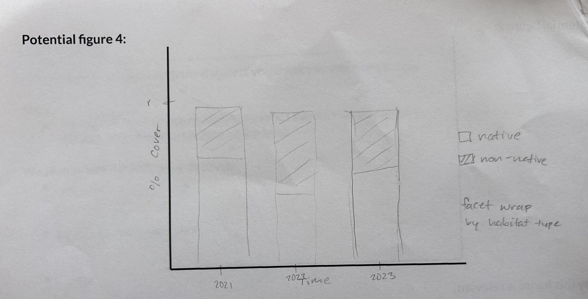

# Group project proposal

**Spring 2026**

Directions:

- Use your work plan from class to fill in the information below.
- Practice pulling, making changes, staging/committing/pulling/pushing to the same repo.
- **Communicate about who is doing what throughout the entire process.**

What you will submit on Friday the 15th:

- proposal: a link to your forked repository with the completed proposal in the README
- work plan: your paper plan that you completed in class on Monday the 4th

Use your project proposal to:

- refer back to the original plan while you are working
- keep track of high-level changes in structure (e.g. role switching, elective modifications)

Note:

- your project proposal is subject to change after you learn more about your datasets and what is possible - allow yourselves the flexibility to make adjustments as needed
- the more detail you can provide in your proposal, the more thorough your feedback will be

## Group members:

Abigail Malech, Henderson Vo, Alyssa Hagele

## Group name (optional):

Veggie Tales 

## Topic information and question

**Topic:**  

Vegetation in NCOS

**Question(s):**  

How have key species changed through time in major habitats?

**Response variable(s)**

- percent cover of vegetation species
- species richness

## Datasets

**Datasets used:**

- veg.csv
- vp_veg_metadata.csv

## Figures

**Potential figure 1:**

This line graph shows the relationship between native species % cover over time. This graph is relevant because we want to show how each native species cover is changing over time.

**Potential figure 2:**

This figure shows species richness of native and non-native species over time, which is relevant to our question looking at how key species are changing over time and could potentially give us more insight as to how non-native species could be changing the composition of key species. 

**Potential figure 3:**

This is a strip chart with means and standard deviations for each species total % cover. This figure is relevant to our research question because we want to compare native species cover across transects. The spread and distribution for each species can be easily shown with individual points, a mean, and a standard deviation. This could strengthen our project with further statistical analysis.

**Potential figure 4**

We want to add a stacked bar chart to compare native vs. non-native cover by percent cover to possibly explain changes in native cover over time (if invasive species is a major contributor).

## Data cleaning/wrangling/summarizing plan

gl_implicitNA
- filtered data to show GL transects (grasslands)
- group observations by year, pool, species
- calculate mean percent cover for observed species 
- create new column called from year and transect name (year_pool)
- join dataframe with metadata 

gl_explicit0
- filter data to show GL transects 
- use complete to include missing observations as 0 
- group by year, pool, species
- calculate total percent cover across quadrants 
- create a new column called year_pool from year and transect name
- join with metadata data frame
- calculate mean percent cover from total percent cover/number of quadrats

gl_native_explicit0
- filter to native species only
- filter to only NCOS grassland transects
- fill missing species observations with zeros
- calculate native species percent cover by transect and year
- join with metadata 
- calculate mean percent cover from total percent cover/number of quadrats

gl_invasive_explicit0
- filter dataset to non-native species only
- filter to only NCOS grassland transects
- fill missing species observations with zeros using complete
- calculate invasive species percent cover by transect and year
- join with metadata 
- calculate mean percent cover from total percent cover/number of quadrats

native_spp
- filter veg dataset to include native grassland species
- pull to extract data frame column as a vector

invasive_spp
- filter veg dataset to include non native grassland species 
- pull to extract data frame column as a vector 

native_species_rich
- group explicit vegetation by year and transect
- filter to include native species with pc over 0 
- calculate native species richness using distinct species counts

invasive_species_rich
- group explicit vegetation by year and transect
- filter to include non native species with pc over 0 
- calculate non naitve species richness using species counts 

native_pc
- filter vegetation dataset to include only native species
- group by year and transect
- calculate native percent cover sum
- join dataframe with metadata
- calculate native percent cover from total percent cover/number of quadrats

invasive_pc
- filter vegetation dataset to include only non-native species
- group by year and transect
- calculate non native percent cover
- join dataframe with metadata
- calculate non native percent cover from total percent cover/number of quadrats

native_interest
- create vector of native species of interest (5 species) 

non_native_interest
- create vector of non native species of interest (5 species)

all_interest
- combine native and non native species of interest for comparative analysis if 
needed

gl_native_interest
- filter native explicit dataset to native species of interest
- add native species classification column

gl_invasive_interest
- filter nonn native explicit dataset to non native species on interest
- add non-native species classification column

gl_all_interest
- combine gl_native_interest and gl_invasive_interest into comparative data 
frame 

## Project roles

**Natural history/framing director:**

Abby

**Stats and visualization director**

Henderson

**GitHub/code director**

Alyssa

## Elective (not required for all groups or group members)

**Group members completing elective:**

Abby, Henderson, Alyssa

**Elective idea:**

A zine featuring different vegetations species in NCOS and general information on each of them.

**Elective timeline (what you will have completed each week):**

Week 7: decide key species to present in zine

Week 8 (timeline check in): gather general data on species, summarize in a research doc, start canva document for zine

Week 9: continue plant research, work on canva design

Week 10: finalize canva design, print and assemble zine

Finals week: present zine

